<p align="center">
  
</p>

<h1 align="center">Chidori</h1>

<p align="center">
  An <b>agent framework where TypeScript agents checkpoint, replay, and resume by default</b>.
  Agents are plain async TypeScript; every side effect flows through the runtime as a recorded
  <b>host call</b> — so a finished run can be saved to disk, replayed for identical output with
  <b>zero LLM calls</b>, and resumed from any pause. One Rust binary, an embedded pure-Rust
  JavaScript engine, and TypeScript + Python SDKs.
</p>

<p align="center">
<a href="https://github.com/ThousandBirdsInc/chidori/commits"></a>
<a href="https://crates.io/crates/chidori"></a>
<a href="https://pypi.org/project/chidori/"></a>
<a href="https://www.npmjs.com/package/chidori"></a>
<a href="https://github.com/ThousandBirdsInc/chidori/blob/main/LICENSE"></a>
</p>

<p align="center">
  <a href="#️-quick-start"><b>⚡️ Quick Start</b></a> ·
  <a href="#-core-concepts"><b>🧩 Core Concepts</b></a> ·
  <a href="#-how-replay-works"><b>⏪ Replay</b></a> ·
  <a href="DESIGN.md"><b>📐 Design</b></a> ·
  <a href="https://discord.gg/CJwKsPSgew"><b>💬 Discord</b></a>
</p>

> **About v3.** Chidori began as a reactive runtime exploring how to build durable, debuggable agents. v3 is a ground-up rewrite that distills those ideas into a smaller, sharper core: a single Rust binary, TypeScript agent authoring, and replay as the foundation for tests, debugging, resume, and human-in-the-loop workflows. Earlier versions of Chidori live in the git history and on prior tags.

## Contents
- [📖 About](#-about)
- [⚡️ Quick Start](#️-quick-start)
- [▶️ Try The Demo](#️-try-the-demo)
- [🧩 Core Concepts](#-core-concepts)
- [🚦 Running Modes](#-running-modes)
- [🐍 Python SDK](#-python-sdk)
- [⏪ How Replay Works](#-how-replay-works)
- [🧪 Examples](#-examples)
- [✅ JavaScript Conformance (Test262)](#-javascript-conformance-test262)
- [🏗 Architecture](#-architecture)
- [📦 Project Structure](#-project-structure)

## 📖 About

- **Agents are TypeScript.** Native async control flow, typed inputs, imports, and editor tooling with no template DSL.
- **Deterministic execution.** Every side effect goes through a host function the runtime can log, cache, and replay.
- **Zero-cost checkpointing.** Save a session's call log to disk, replay it later for identical output with zero LLM calls.
- **Event-driven agents.** Agents can run as HTTP servers that react to webhooks and other events.
- **Rust core, TS and Python SDKs.** The runtime is a single binary. SDKs talk to it over HTTP without native bindings.

The whole model fits in one picture — agents never touch the world directly, so the runtime
sees (and records) everything:

<p align="center">
  
</p>

## ⚡️ Quick Start

### 1. Write an agent

```ts
// agents/summarizer.ts
import type { Chidori } from "chidori";

export async function agent(input: { document: string }, chidori: Chidori) {
  const summary = await chidori.prompt(
    "Summarize in 3 bullets:\n" + input.document,
    { type: "summary" },
  );
  const actionItems = await chidori.prompt(
    "Extract action items:\n" + summary,
    { type: "actions" },
  );
  return { summary, actionItems };
}
```

### 2. Run it

```bash
# Set up LLM provider (uses LiteLLM in this example)
export LITELLM_API_URL=http://localhost:4401/v1
export LITELLM_API_KEY=sk-litellm-master-key

# Or use providers directly
# export ANTHROPIC_API_KEY=sk-ant-...
# export OPENAI_API_KEY=sk-...

cargo build
./target/debug/chidori run agents/summarizer.ts \
  --input document="Rust is a systems programming language..."
```

### 3. Try the example agents

```bash
# Interactive example picker
./target/debug/chidori demo

# Minimal agent — no LLM calls needed
./target/debug/chidori run examples/agents/hello.ts --input name=Colton

# Local TypeScript tool — no LLM calls needed
./target/debug/chidori run examples/agents/tool_use.ts \
  --input query=chidori --tools examples/tools

# Summarizer with trace
./target/debug/chidori run examples/agents/summarizer.ts \
  --input document="Rust is great." --trace

# Parallel host work
./target/debug/chidori run examples/agents/parallel.ts \
  --input '{"topic": "runtime snapshots"}'

# Event-driven webhook handler
./target/debug/chidori serve examples/agents/webhook.ts --port 8080
```

## ▶️ Try The Demo

The easiest way to explore Chidori is the interactive demo picker:

```bash
cargo build
./target/debug/chidori demo
```

`chidori demo` shows a numbered list of runnable examples, including demos that
do not need an LLM provider and demos that exercise prompt tracing or streaming
when provider environment variables are configured. Choose **Hello agent** for
the fastest no-key path.

That demo runs a TypeScript agent, records a durable host-call log, and returns
JSON. The direct command is:

```bash
./target/debug/chidori run examples/agents/hello.ts --input name=Colton
```

Expected output:

```json
{
  "greeting": "Hello, Colton!"
}
```

What this demonstrates:

- `examples/agents/hello.ts` exports `agent(input, chidori)`.
- The agent calls `chidori.log(...)`, so the runtime records a host call.
- The agent returns plain JSON, which is what CLI, server, and SDK users receive.
- A checkpoint is written under `examples/agents/.chidori/runs/<run_id>/` for
  trace/replay workflows.

You can inspect the most recent run:

```bash
RUN_ID=$(ls -t examples/agents/.chidori/runs | head -1)
./target/debug/chidori trace "$RUN_ID" --dir examples/agents
./target/debug/chidori snapshot "$RUN_ID" --dir examples/agents
```

### Human-In-The-Loop Demo

This demo shows the session API pausing on `chidori.input(...)` and resuming
from the persisted call log:

<p align="center">
  
</p>

Start the server:

```bash
./target/debug/chidori serve examples/agents/input_pause.ts --port 8080
```

In another terminal, create a session:

```bash
curl -s http://localhost:8080/sessions \
  -H "Content-Type: application/json" \
  -d '{"input":{"request":"ship the TypeScript runtime"}}'
```

The response will have `"status":"paused"`, an `"id"`, and
`"pending_prompt":"Approve this request?"`. Resume it with:

```bash
SESSION_ID=<paste id from the previous response>

curl -s http://localhost:8080/sessions/$SESSION_ID/resume \
  -H "Content-Type: application/json" \
  -d '{"response":"yes"}'
```

The completed response includes:

```json
{
  "output": {
    "request": "ship the TypeScript runtime",
    "approved": true
  }
}
```

That flow is the core Chidori loop: TypeScript code runs until a durable host
operation pauses, Chidori persists the run, and resume re-executes the agent
against the persisted call log to continue from where it paused.

## 🧩 Core Concepts

An agent is a `.ts` file that exports an async `agent(input, chidori)` function. The runtime provides a fixed set of **host functions** for side effects through the `chidori` object:

| Function | Purpose |
|---|---|
| `chidori.prompt(text, { type, ... })` | Send to an LLM, return string or parsed JSON; streamed prompt events carry the optional type |
| `chidori.context()` | Immutable multi-turn prompt builder with prefix sharing and provider prompt caching |
| `chidori.template(strOrPath, vars)` | Render a Jinja2 template with minijinja |
| `chidori.tool(name, args)` | Invoke a registered tool |
| `chidori.callAgent(path, input)` | Call a sub-agent |
| `chidori.parallel(fns)` | Run functions concurrently |
| `chidori.input(msg, options)` | Human-in-the-loop — pauses execution |
| `chidori.signal(name, options)` | Multiplayer — pause at a named listen point until an outside party (human or agent) delivers `{ name, payload, from }`; drains a durable mailbox if one is queued |
| `chidori.pollSignal(name)` | Non-blocking signal check — consume a queued signal of this name or resolve to `null` |
| `chidori.http(url, options)` | Make an HTTP request |
| `chidori.memory(action, ...)` | Persistent storage (key-value + vector) |
| `chidori.log(msg, data)` | Structured logging |
| `chidori.checkpoint(label, meta)` | Record an explicit call-log marker for trace/replay |
| `chidori.step(name, fn)` | Durable value checkpoint — run pure compute once, journal the result, never re-pay it on replay/resume |
| `chidori.retry(fn, options)` | Retry with backoff |
| `chidori.tryCall(fn)` | Capture errors without raising |

See [`llm.txt`](./llm.txt) for the full API reference.

### Streaming Prompt Progress

Agents can label prompt output streams with `type` so UIs can filter incremental
progress separately from final answers:

```ts
const status = await chidori.prompt("Say what work is starting", { type: "progress" });
const answer = await chidori.prompt("Write the final answer", { type: "final" });
```

When using `--stream` or `POST /sessions/stream`, prompt calls emit
`prompt_start`, `prompt_delta`, and `prompt_end` events with `stream_id`,
`seq`, and `prompt_type`. This also works for prompts inside
`chidori.parallel(...)` branches and `chidori.callAgent(...)` sub-agents. See
[`examples/agents/streaming_progress.ts`](./examples/agents/streaming_progress.ts).

### Prompt Caching

Every prompt automatically marks its stable head (system prompt, tool schemas,
conversation prefix) for the provider's prompt cache, so a tool loop or
multi-turn conversation re-bills its prefix at the cached rate (~10% of base
input on Anthropic) instead of full price each turn. Disable per call with
`cache: false`. For long-lived contexts, build them once with
`chidori.context()` — an immutable, prefix-sharing conversation builder — and
the cache hits become structural:

```ts
const base = chidori.context().system(INSTRUCTIONS).doc("corpus", corpus).cacheBreakpoint("1h");
let ctx = base.user(firstQuestion);
const { text, context } = await ctx.prompt();
```

Cache effectiveness is measurable: prompt records and OTEL spans carry
`cache_creation`/`cache_read` token counts, and `total_cost_usd` prices them
at the provider's cached rates. Caching never changes results — replay returns
recorded results and pays zero tokens either way. See
[`docs/context-management.md`](./docs/context-management.md).

## 🚦 Running Modes

### 1. One-shot CLI

```bash
chidori demo                                  # pick from runnable examples
chidori run agents/my_agent.ts --input key=value
chidori run agents/my_agent.ts --input '{"complex": "input"}'
chidori check agents/my_agent.ts            # validate without running
chidori tools --dir tools/                   # list available tools
```

### 2. HTTP Server (event-driven + session API)

```bash
chidori serve agents/my_agent.ts --port 8080
```

Exposes:
- `GET  /health` — health check
- `ANY  /*` — any request is passed to `agent(event)` as an event dict
- `POST /sessions` — create a session and run the agent with given input
- `GET  /sessions` — list all sessions
- `GET  /sessions/{id}` — get session result
- `GET  /sessions/{id}/checkpoint` — get the call log and snapshot manifest metadata
- `GET  /sessions/{id}/snapshot` — inspect the durable journal-scaffold manifest metadata (no VM image — resume is call-log replay)
- `POST /sessions/{id}/resume` — resume a paused `input()` or approval session
- `POST /sessions/{id}/signal` — deliver a signal `{ name, payload?, from? }`: resolves+resumes a run paused-waiting on that name (200), else enqueues into the durable mailbox (202), or 409 for a terminal run
- `POST /sessions/{id}/replay` — replay from a session's checkpoint
- `POST /sessions/{id}/cancel` — cancel a running or stored session
- `POST /sessions/stream` — run a session with SSE call and prompt progress events

### 3. Event-Driven Agents

An agent can handle incoming HTTP events:

```ts
// agents/webhook.ts
import type { Chidori } from "chidori";

export async function agent(
  input: { url: string; payload?: Record<string, unknown> },
  chidori: Chidori,
) {
  const response = await chidori.http(input.url, {
    method: "POST",
    body: input.payload ?? { source: "chidori" },
  });
  return { status: response.status, body: response.body };
}
```

```bash
chidori serve agents/webhook.ts --port 8080

curl -X POST http://localhost:8080/github \
  -H "Content-Type: application/json" \
  -d '{"action": "opened", "pull_request": {"title": "Add login"}}'
```

## 🐍 Python SDK

The Python SDK is a pure-stdlib HTTP client that talks to a running `chidori serve` instance. No `pip install`, no native bindings.

```python
import sys
sys.path.insert(0, "sdk/python")

from chidori import AgentClient, Checkpoint

client = AgentClient("http://localhost:8080")

# Create a session (runs the agent with live LLM calls)
session = client.run({"document": "Rust is a systems language."})
print(session.output)
# {"summary": "...", "action_items": "..."}

# Save a checkpoint to disk
checkpoint = session.checkpoint()
checkpoint.save("/tmp/session.json")
```

Later, replay the session from disk — **zero LLM calls**:

```python
from chidori import AgentClient, Checkpoint

client = AgentClient("http://localhost:8080")
cp = Checkpoint.load("/tmp/session.json")

# Replay: re-executes the agent but returns cached host-call results
replayed = client.replay(cp)
assert replayed.output == session.output  # identical output
```

## ⏪ How Replay Works

<p align="center">
  
</p>

TypeScript durable runs use deterministic runtime policy plus cached host-call
results. Given the same inputs, compatible source hashes, and the same cached
results for host calls, agent control flow is expected to produce the same
outputs.

1. **Original run:** Every `prompt()`, `tool()`, `http()` call is logged with seq number + result.
2. **Checkpoint:** The call log is a JSON array — save it to disk, send it over the wire, commit it to git.
3. **Replay:** Re-run the agent with the call log pre-loaded. Each host function call checks the log for its seq number — hit returns the cached result instantly, miss executes normally.

This means you can:
- **Debug without spending money:** save a failing session, replay locally with breakpoints.
- **Run deterministic tests:** check in a checkpoint, assert the agent's behavior hasn't changed.
- **Resume after crashes:** the runtime can persist checkpoints after each call; on restart, replay picks up where it left off.
- **Pause for human approval:** `input()` suspends execution; when the human responds, the agent replays to that point and continues.

## 🧪 Examples

See [`examples/`](./examples):

- [`agents/hello.ts`](./examples/agents/hello.ts) — minimal agent, no LLM
- [`agents/summarizer.ts`](./examples/agents/summarizer.ts) — LLM summary pipeline
- [`agents/context_qa.ts`](./examples/agents/context_qa.ts) — cache-aware multi-turn Q&A via `chidori.context`
- [`agents/streaming_progress.ts`](./examples/agents/streaming_progress.ts) — labelled prompt progress streams
- [`agents/webhook.ts`](./examples/agents/webhook.ts) — event-driven HTTP handler
- [`agents/tool_use.ts`](./examples/agents/tool_use.ts) — tool call example
- [`sdk_demo.py`](./examples/sdk_demo.py) — Python SDK with checkpointing + replay
- [`prompts/analysis.jinja`](./examples/prompts/analysis.jinja) — shared prompt template
- [`tools/web_search.ts`](./examples/tools/web_search.ts) — simple tool definition
- [`legacy-starlark/`](./examples/legacy-starlark) — archived Starlark examples kept for migration reference

## ✅ JavaScript Conformance (Test262)

Chidori executes agent code on its **embedded pure-Rust JavaScript engine**
(`crates/chidori-js`, oxc parser → bytecode → stack VM, zero `unsafe`, no C) —
the only JS engine in the tree. To check that engine against the same yardstick
Bun and Node use, we run [**Test262**](https://github.com/tc39/test262) — the
official TC39 ECMAScript conformance suite.

```bash
# Vendor the pinned suite (shallow clone of tc39/test262) and run language + built-ins.
scripts/test262.sh

# Run a subset:
scripts/test262.sh test/built-ins/Array
scripts/test262.sh --filter Promise

# Full machine-readable report + per-failure detail:
scripts/test262.sh --json target/test262-report.json --verbose
```

The runner prints a pass/fail/skip summary:

```
Test262 (chidori pure-Rust engine, bare context)
  pass 39017  fail 757  skip 7517  =>  98.10% of executed
```

It drives the **bare ECMAScript context** (no `chidori` host object), so the
number is pure language conformance — directly comparable to how Bun and Node
report it. The percentage is `pass / (pass + fail)` over *executed* tests; the
skip count is reported alongside so the denominator is never hidden. Features
the engine intentionally does not implement — `Intl`, `Temporal`,
`Atomics`/`SharedArrayBuffer`, `WeakRef`/`FinalizationRegistry`, `ShadowRealm`,
decorators, iterator helpers (the same kinds of things Bun/Node skip) — are
reported as `skip`, never hidden.

Because `chidori-js` has no fallback engine, conformance is **load-bearing**: a
language regression directly breaks real agents. CI gates every engine change
against a committed per-test baseline
(`crates/test262-runner/test262-expectations.json`) at a pinned suite commit,
plus a nightly run — see
[`.github/workflows/test262.yml`](./.github/workflows/test262.yml).

You can also run the runner directly (after `cargo build --release -p test262-runner`):

```bash
target/release/test262-runner --test262 vendor/test262 --help
```

### Remaining gaps

The residual failures, by area (top clusters of the 757 total):

| count | area | nature |
|--:|---|---|
| 198 | `language/expressions` | class element corners (direct-eval contexts, per-evaluation private brands), dynamic-`import()` semantics, tagged-template caching |
| 111 | `language/statements` | remaining class element corners, labelled/eval interplay |
| 94 | `built-ins/RegExp` | lone-surrogate matching (needs UTF-16 strings); `v`-flag; `prototype` long tail |
| 59 | `built-ins/String` | `normalize`, Unicode/surrogate edge cases |
| 36 | `built-ins/Object` | array `length` descriptor corners; sparse indices beyond the dense cap |
| 22 | `language/module-code` | namespace internals, hoisted default-function exports, TLA ordering |
| 18 | `language/eval-code` | eval-created binding attribute corners |
| 15 | `built-ins/Array` | sparse indices beyond the dense cap; UTF-16 string spread |
| 15 | `built-ins/Date` | parse/format edge cases |
| 13 | `built-ins/Proxy` | proxy-of-proxy forwarding details |

See [`docs/conformance.md`](./docs/conformance.md) for the measurement
methodology, the honest skip policy, the CI gate, and the full breakdown.

## 🏗 Architecture

```
┌─────────────────────────────────────────────────────┐
│   User code (.ts files, .jinja prompts, SDKs)        │
└────────────────────────┬────────────────────────────┘
                         │
┌────────────────────────▼────────────────────────────┐
│               Rust Core Runtime                      │
│                                                      │
│  ┌─────────────┐ ┌──────────────┐ ┌──────────────┐  │
│  │ TypeScript  │ │ Host Function│ │  Call log /  │  │
│  │  Runtime    │ │ Registry     │ │   Replay     │  │
│  └─────────────┘ └──────────────┘ └──────────────┘  │
│  ┌─────────────┐ ┌──────────────┐ ┌──────────────┐  │
│  │  LLM Client │ │  Template    │ │  HTTP Server │  │
│  │  (providers)│ │  (minijinja) │ │  (axum)      │  │
│  └─────────────┘ └──────────────┘ └──────────────┘  │
└──────────────────────────────────────────────────────┘
```

- **TypeScript runtime** transpiles `.ts` agents and exposes a deterministic `chidori` host API.
- **Host functions** are the only way agents touch the outside world.
- **Call-log / replay engine** records every host call and replays the journal for deterministic, zero-LLM-call resume.
- **LLM providers** (Anthropic, OpenAI, LiteLLM-compatible) are swappable via `reqwest`.
- **Template engine** uses `minijinja` for Jinja2 prompt templates.
- **HTTP server** (`axum`) powers the `serve` command and session API.

See [`DESIGN.md`](./DESIGN.md) for the full architecture and design rationale, and [`TODO.md`](./TODO.md) for the implementation roadmap.

## 📦 Project Structure

```
chidori/
├── src/
│   ├── main.rs             # CLI entry point
│   ├── server.rs           # HTTP server (serve + session API)
│   ├── runtime/
│   │   ├── engine.rs       # agent dispatch + runtime persistence
│   │   ├── typescript/     # TypeScript runtime, bindings, tools, transpile
│   │   ├── host_core.rs    # language-neutral durable host behavior
│   │   ├── context.rs      # Runtime context (call log + replay)
│   │   ├── call_log.rs     # Checkpoint data structures
│   │   └── template.rs     # minijinja integration
│   ├── providers/
│   │   ├── mod.rs          # Provider registry, model routing
│   │   ├── anthropic.rs    # Anthropic Messages API
│   │   └── openai.rs       # OpenAI-compatible (incl. LiteLLM)
│   └── tools/
│       └── mod.rs          # Tool discovery + JSON schema generation
├── crates/
│   ├── chidori-js/         # Pure-Rust JS engine (oxc → bytecode → VM), the only engine
│   └── test262-runner/     # Test262 conformance harness + baseline gate
├── sdk/
│   ├── typescript/         # TypeScript SDK (zero-dependency HTTP client)
│   └── python/chidori/     # Python SDK (pure stdlib, no deps)
├── examples/
│   ├── agents/             # Example .ts agents
│   ├── prompts/            # Example .jinja templates
│   ├── tools/              # Example tools
│   ├── legacy-starlark/    # Archived .star examples
│   └── sdk_demo.py         # Python SDK demo
├── DESIGN.md               # Architecture & design rationale
├── TODO.md                 # Implementation roadmap
└── llm.txt                 # Complete API reference for LLM-assisted development
```
