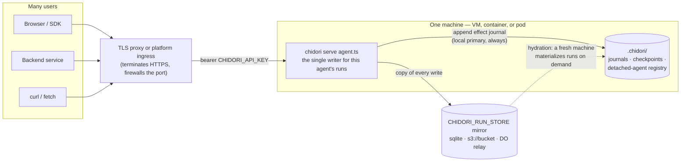
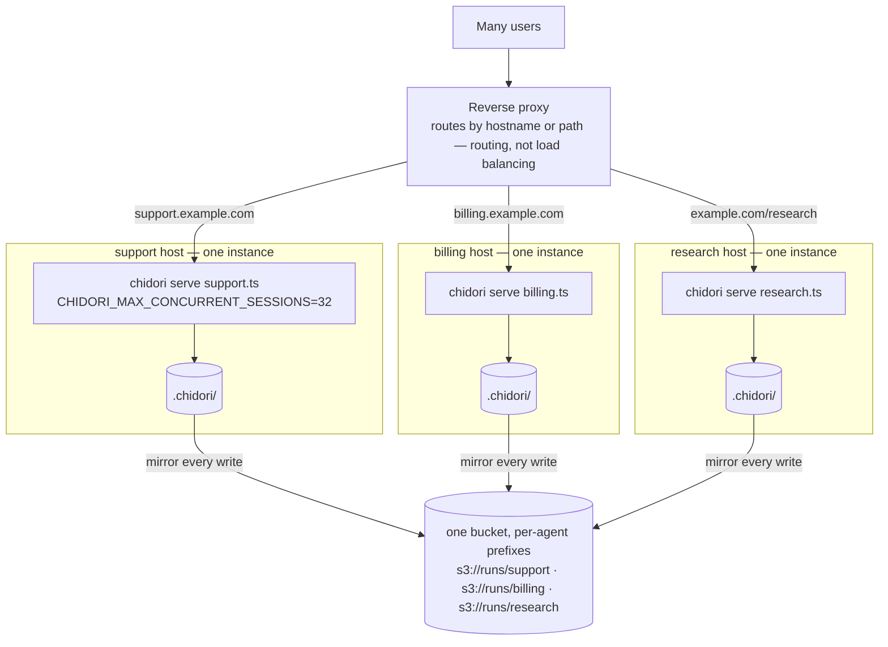
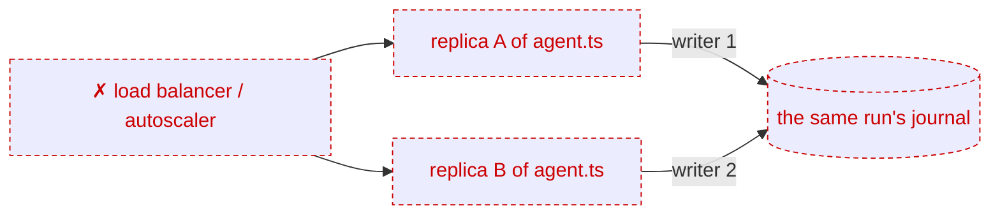
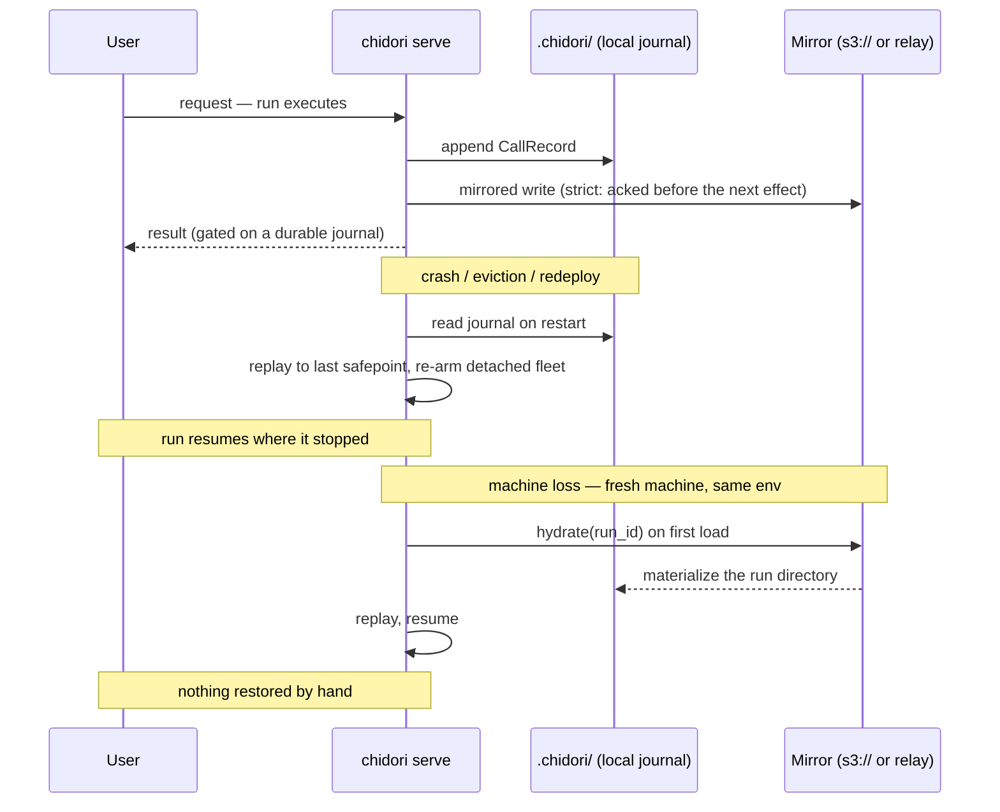

# Deploying Chidori

A deployment is four things: the `chidori` binary, your agent's `.ts` files,
a handful of environment variables, and one state directory — `.chidori/`
next to the agent file, where every journal, checkpoint, and the
detached-agent registry live. There is no Node runtime, database server,
queue, or worker fleet to provision.

You make two decisions: **where the journal lives** and **where the process
runs**. Everything else is the same everywhere.

## The shape of every deployment

However many users you serve and wherever the process runs, the structure is
the same: many clients, one TLS front door, **one** `chidori serve` process
per agent file, one state directory, and an optional durable mirror behind
it.



Concurrency for many users comes from *sessions inside* that one process
(`CHIDORI_MAX_CONCURRENT_SESSIONS`), and durability comes from the journal
and its mirror — not from running more copies of the process. That is what
the three rules below encode.

## Three rules every deployment follows

1. **All state is one directory.** Back up `.chidori/` — or mirror it with
   `CHIDORI_RUN_STORE` — and the machine is disposable: a fresh machine with
   the same env **hydrates** any run from the mirror on demand
   ([durable storage](./durable-storage.md)).
2. **One process per agent.** A run has a single writer. Never run replicas
   behind a load balancer or autoscale this workload; to go wider, run one
   server per agent file and route by hostname or path.
3. **Keep the process alive.** Detached-agent alarms, signal deliveries, and
   paused runs need a live server, so no scale-to-zero or app-sleep.
   Auto-restart *is* the recovery mechanism: at boot the server re-arms the
   [detached-agent fleet](./detached-agents.md) and resumes interrupted runs
   by replay from their last safepoint.

## Configuration (identical on every host)

```bash
ANTHROPIC_API_KEY=sk-ant-...        # or OPENAI_API_KEY / LITELLM_API_URL
CHIDORI_API_KEY=<long random>       # bearer auth on everything except GET /health
CHIDORI_DB_PATH=.chidori/sessions.sqlite3   # session index; in-memory without it
CHIDORI_RUN_STORE=sqlite            # journal mirror — see table below
CHIDORI_DURABILITY=strict           # refuse side effects the journal hasn't recorded
```

- **TLS:** the server speaks plain HTTP on `0.0.0.0:<port>`. Put a reverse
  proxy or the platform's TLS in front, and firewall the port.
- **Policy:** `chidori serve` is **deny-by-default** — gated effects (`fetch`,
  workspace mutations) are refused until you configure `CHIDORI_POLICY_FILE`
  (an explicit allowlist; malformed policy fails closed) or pass `--trusted`
  for a server running only your own code. See
  [sandbox model](./sandbox-model.md).
- **Optional:** `CHIDORI_CORS_ORIGINS` for browser callers;
  `CHIDORI_MAX_CONCURRENT_SESSIONS` (default 8) to cap parallel runs;
  `CHIDORI_SECRET_ENV` to pass secrets as placeholder tokens the journal
  never sees; `CHIDORI_ISOLATE=process` to sandbox untrusted agent code (in
  containers, set `CHIDORI_ISOLATE_REQUIRE_SANDBOX=1` to fail closed — the
  network-namespace layer needs `CAP_SYS_ADMIN` and is skipped without it).

## Decision 1: where the journal lives

Local disk is always the fast primary; `CHIDORI_RUN_STORE` adds a mirror.
Each tier survives strictly more:

| `CHIDORI_RUN_STORE` | Survives | Depends on |
|---|---|---|
| unset / `fs` | crash, restart, redeploy | nothing |
| `sqlite` | + single-file backup; serialized writers | nothing |
| `s3://bucket/prefix` | **+ machine loss** (hydration) | any S3 API: AWS, R2, GCS, Backblaze, self-hosted MinIO |
| `https://…` relay | + cross-DC replication, 30-day PITR, platform-enforced single writer | [Cloudflare Durable Objects](../integrations/cloudflare-durable-objects/) |

Rule of thumb: `sqlite` on a durable disk you back up; `s3://` when the
machine is ephemeral (containers, managed hosts); the Durable Object relay
when you want the strongest failover guarantees.

## Decision 2: where the process runs

### A VM — simplest, no specialized providers

Any Linux machine from any host. Install the binary
([README](../README.md#0-install)), copy the project to `/opt/my-agent`, put
the env block above in `/etc/chidori/env` (mode `0600`), and run it under
systemd:

```ini
# /etc/systemd/system/chidori.service
[Unit]
Description=Chidori agent server
After=network-online.target
Wants=network-online.target

[Service]
User=chidori
WorkingDirectory=/opt/my-agent
EnvironmentFile=/etc/chidori/env
ExecStart=/usr/local/bin/chidori serve agent.ts --port 8080
Restart=always
RestartSec=2

[Install]
WantedBy=multi-user.target
```

Backups are `rsync` of `/opt/my-agent/.chidori/`. Restore = install binary,
copy directory back, start service; paused runs resume where they stopped.
Upgrades = replace the binary, restart.

### A container — the base for the next two options

```dockerfile
FROM debian:bookworm-slim
RUN apt-get update && apt-get install -y --no-install-recommends ca-certificates curl \
    && curl -fsSL https://raw.githubusercontent.com/ThousandBirdsInc/chidori/main/scripts/install.sh | sh \
    && mv /root/.chidori/bin/chidori /usr/local/bin/ \
    && rm -rf /var/lib/apt/lists/*
WORKDIR /app
COPY . .
EXPOSE 8080
CMD ["chidori", "serve", "agent.ts", "--port", "8080"]
```

Pair it with an `s3://` mirror instead of a volume — hydration makes the
container disposable.

### Fly.io, Railway, Render — easy-to-provision hosts

All three run the container as a long-lived process, terminate TLS, restart
crashes, and hold secrets. Apply rules 2 and 3: **one instance, no
sleep/scale-to-zero** (Railway: disable app sleeping; Render: use a paid Web
Service — free instances spin down — with health check path `/health`).

Fly.io:

```toml
# fly.toml
app = "my-agent"
primary_region = "iad"

[env]
  CHIDORI_DURABILITY = "strict"
  CHIDORI_RUN_STORE = "s3://my-agent-runs"   # Fly's Tigris speaks the S3 API

[http_service]
  internal_port = 8080
  force_https = true
  auto_stop_machines = "off"
  min_machines_running = 1

  [[http_service.checks]]
    path = "/health"
    interval = "15s"
    timeout = "2s"
```

```bash
fly launch --no-deploy
fly secrets set ANTHROPIC_API_KEY=... CHIDORI_API_KEY=... \
  AWS_ACCESS_KEY_ID=... AWS_SECRET_ACCESS_KEY=...
fly deploy && fly scale count 1
```

If Fly replaces the machine, the new one hydrates from the bucket — nothing
to restore.

### An existing Kubernetes cluster

Same container, expressed as a single-replica Deployment. Two
Kubernetes-specific points: `strategy: Recreate` (a rolling update runs old
and new pods side by side — see [overlap](#when-things-fail)), and no HPA.

```yaml
apiVersion: apps/v1
kind: Deployment
metadata:
  name: my-agent
spec:
  replicas: 1
  strategy: { type: Recreate }
  selector:
    matchLabels: { app: my-agent }
  template:
    metadata:
      labels: { app: my-agent }
    spec:
      containers:
        - name: chidori
          image: registry.example.com/my-agent:v1
          ports: [{ containerPort: 8080 }]
          env:
            - { name: CHIDORI_DURABILITY, value: "strict" }
            - { name: CHIDORI_RUN_STORE, value: "s3://my-agent-runs" }
          envFrom:
            - secretRef: { name: my-agent-secrets }
          readinessProbe:
            httpGet: { path: /health, port: 8080 }
          livenessProbe:
            httpGet: { path: /health, port: 8080 }
          resources:
            requests: { cpu: "500m", memory: "1Gi" }
            limits: { memory: "4Gi" }   # pair with CHIDORI_JS_MEM_CAP_MB
---
apiVersion: v1
kind: Service
metadata:
  name: my-agent
spec:
  selector: { app: my-agent }
  ports: [{ port: 80, targetPort: 8080 }]
```

Front it with your standard Ingress + TLS, and keep `CHIDORI_API_KEY` set
even in-cluster. Prefer the stateless pod + `s3://` mirror over a
`ReadWriteOnce` PVC at `/app/.chidori` (which pins the pod to a volume);
liveness restarts and node evictions are just rule 3's recovery path.

### Vercel and other serverless platforms — not for the runtime

Request-scoped functions can't host a long-lived server (nothing stays up to
listen, wake hibernating agents, or fire alarms). Host your frontend or API
on Vercel and drive a Chidori server elsewhere via the
[TypeScript SDK](../sdk/typescript/README.md) or plain `fetch`, setting
`CHIDORI_CORS_ORIGINS` if the browser calls Chidori directly. The one
serverless piece that exists is storage: the
[Durable Object run store](../integrations/cloudflare-durable-objects/) is a
Worker that runs only when a write or hydration read arrives.

## Scaling to many users

Scale in two moves, in this order:

1. **Scale up** — a bigger machine and a higher
   `CHIDORI_MAX_CONCURRENT_SESSIONS`. One process multiplexes many
   concurrent runs; most deployments never need move 2.
2. **Scale out by sharding on the agent file** — one server per agent, each
   the single writer for its own runs, with its own state directory and its
   own mirror prefix. The router in front routes by hostname or path; it
   never balances between copies of the same agent.



Durability is unchanged by sharding: every shard keeps
`CHIDORI_DURABILITY=strict` and its own mirror prefix, so losing any one
host loses no acknowledged work — its replacement hydrates that agent's
runs from the mirror while the other shards keep serving.

What scaling out must **never** look like is replicas of the same agent
behind a load balancer:



A run has exactly one writer. Two replicas sharing a mirror means two
processes appending to the same journal: requests for a run land on an
instance that doesn't own it, and the writers race. Run leases make the
loser stand down, but they are advisory on `fs` and `s3://` backends
([when things fail](#when-things-fail)) — and even where they are enforced
(`sqlite`, the Durable Object relay), the losing replica is dead weight
that serves errors. Nothing routes a request to a run's owner;
active–active is a documented non-goal
([durable storage](./durable-storage.md)).

One caveat as runs grow long rather than numerous: resuming a very long
run replays its whole journal (fast and $0, but O(history) — see
[resume performance](./resume-performance.md)).

## When things fail

With `CHIDORI_DURABILITY=strict` and a remote mirror, every acknowledged
side effect has a durable recording — so no failure below loses completed
work. The two recovery paths look like this:



- **Crash / eviction / redeploy** → supervisor restarts the process → runs
  resume by replay, fleet re-arms. Recovery time is a restart.
- **Machine loss** → replacement machine (same env) hydrates runs from the
  mirror on demand. Nothing to restore by hand — but do one drill.
- **Deploy overlap** (old and new instance briefly both alive) → run leases
  make the loser stand down. They are *enforced* on `sqlite` and the Durable
  Object relay, but *advisory* (last-writer-wins) on `fs` and `s3://` — so on
  those backends configure deploys to stop the old instance first
  (`Recreate`, not rolling).
- **Faster manual failover** → keep a second instance configured against the
  same mirror but *stopped*; promoting it is starting it. Active–active is
  not a supported mode — nothing routes requests to a run's owner (a
  documented non-goal in [durable storage](./durable-storage.md)).

## Production checklist

- [ ] `CHIDORI_API_KEY` set; port reachable only through a TLS proxy
- [ ] Policy configured (`CHIDORI_POLICY_FILE`, or a deliberate `--trusted`)
- [ ] `CHIDORI_DB_PATH` set so sessions survive restarts
- [ ] `CHIDORI_RUN_STORE` chosen; `s3://` if the machine is ephemeral
- [ ] `CHIDORI_DURABILITY=strict`
- [ ] `.chidori/` backed up, or a hydration drill done against the mirror
- [ ] Auto-restart on (`Restart=always` / platform restarts / liveness probe)
- [ ] One instance per agent; no replicas, HPA, or scale-to-zero
