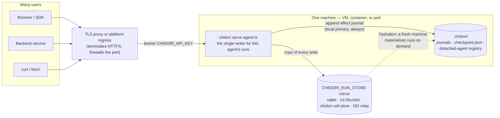
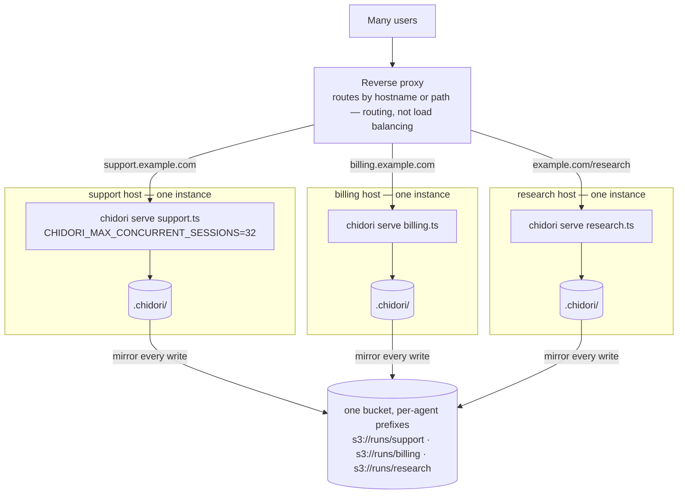
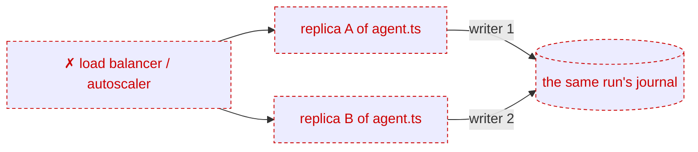
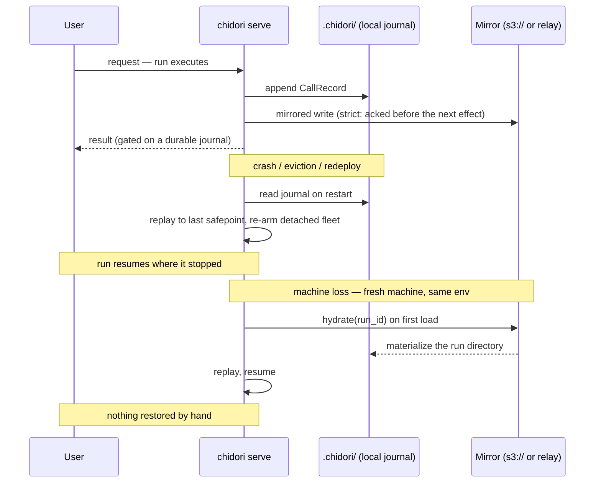

# Deploying Chidori

A deployment is four things: the `chidori` binary, your agent's `.ts` files,
a handful of environment variables, and one state directory — `.chidori/`
next to the agent file, where every journal, `checkpoint.json`, and the
[detached-agent registry](./detached-agents.md) live. There is no Node
runtime, database server,
queue, or worker fleet to provision.

You make two decisions: **where the journal lives** and **where the process
runs**. Everything else is the same everywhere.

## The shape of every deployment

However many users you serve and wherever the process runs, the structure is
the same: many clients, one TLS front door, **one** `chidori serve` process
per agent file, one state directory, and an optional durable mirror behind
it.


```mermaid
flowchart LR
    subgraph clients["Many users"]
        u1["Browser / SDK"]
        u2["Backend service"]
        u3["curl / fetch"]
    end

    proxy["TLS proxy or platform ingress<br/>(terminates HTTPS, firewalls the port)"]

    subgraph host["One machine — VM, container, or pod"]
        server["chidori serve agent.ts<br/>the single writer for this agent's runs"]
        state[(".chidori/<br/>journals · checkpoint.json ·<br/>detached-agent registry")]
    end

    mirror[("CHIDORI_RUN_STORE mirror<br/>sqlite · s3://bucket ·<br/>chidori cell-store · DO relay")]

    u1 --> proxy
    u2 --> proxy
    u3 --> proxy
    proxy -->|"bearer CHIDORI_API_KEY"| server
    server -->|"append effect journal<br/>(local primary, always)"| state
    server -->|"copy of every write"| mirror
    mirror -.->|"hydration: a fresh machine<br/>materializes runs on demand"| state
```

Concurrency for many users comes from *sessions inside* that one process
(`CHIDORI_MAX_CONCURRENT_SESSIONS`), and durability comes from the journal
and its mirror — not from running more copies of the process. That is what
the three rules below encode.

When one server hosts more than a single agent file — a detached-agent
fleet, cron schedules, webhook routes — describe the app in a manifest and
start it with `chidori serve --app chidori.app.yml`; see the
[CLI reference](./cli.md) and [Running Modes](./running-modes.md).

## Three rules every deployment follows

1. **All state is one directory.** Back up `.chidori/` — or mirror it with
   `CHIDORI_RUN_STORE` — and the machine is disposable: a fresh machine with
   the same env **hydrates** any run from the mirror on demand
   ([durable storage](./durable-storage.md)).
2. **One process per agent.** A run has a single writer. Never run replicas
   behind a load balancer or autoscale this workload; to go wider, run one
   server per agent file and route by hostname or path.
3. **Keep the process alive.** Detached-agent alarms, signal deliveries, and
   paused runs need a live server, so no scale-to-zero or app-sleep.
   Auto-restart *is* the recovery mechanism: at boot the server re-arms the
   [detached-agent fleet](./detached-agents.md) and resumes interrupted runs
   by replaying their journals from the last safepoint
   ([Replay & Resume](./replay.md)).

## Configuration (identical on every host)

```bash
ANTHROPIC_API_KEY=sk-ant-...        # or OPENAI_API_KEY, or CHIDORI_OPENAI_COMPAT_URL + _KEY (any OpenAI-compatible endpoint)
CHIDORI_API_KEY=<long random>       # bearer auth on everything except GET /health
CHIDORI_DB_PATH=.chidori/sessions.sqlite3   # session index; this path is the default (`:memory:` opts out)
CHIDORI_RUN_STORE=sqlite            # journal mirror for a persistent VM whose disk you back up;
                                    # use s3://bucket when the machine is ephemeral — see Decision 1
CHIDORI_DURABILITY=strict           # refuse side effects the journal hasn't recorded
```

- **API-key rotation:** `CHIDORI_API_KEY` accepts a comma-separated list, so
  a key rotates without a hard cutover — set `new-key,old-key`, roll every
  client to the new key, then drop the old one. Comparison is constant-time.
- **SDK clients authenticate with the same key:** pass it as
  `new AgentClient(url, { apiKey })` (TypeScript) or
  `AgentClient(url, api_key=...)` (Python) — it rides every request,
  including the SSE stream.
- **SSRF guard:** the `http`/`fetch` effect refuses destinations that resolve
  to non-public addresses (loopback, RFC 1918, link-local/cloud-metadata,
  CGNAT, and their IPv6 equivalents), checked at DNS-resolution time and on
  every redirect hop, so agents can't pivot into `169.254.169.254` or
  internal services. A policy rule that unconditionally allows an `http`
  endpoint (`always_allow` + `url_prefix`) registers its host with the
  guard automatically — one rule opens the one gate. For allowances outside
  the policy (or ask-gated endpoints), set `CHIDORI_HTTP_ALLOW_HOSTS`
  (comma-separated hostnames, IPs, or CIDRs, e.g. `localhost,10.2.0.0/16`);
  the single value `*` disables the guard.

- **Bind address:** the server binds loopback (`127.0.0.1:<port>`) by
  default, so a fresh `chidori serve` is not reachable from the network. To
  expose it — in a container, or to a proxy on another machine — pass
  `--host 0.0.0.0` (or set `CHIDORI_HOST`). A non-loopback bind **requires
  `CHIDORI_API_KEY`**; the server refuses to start otherwise. If access is
  genuinely controlled in front of the server (reverse-proxy auth, network
  policy), `CHIDORI_ALLOW_UNAUTHENTICATED=1` overrides the refusal.
- **TLS:** the server speaks plain HTTP on whatever it binds. Put a reverse
  proxy or the platform's TLS in front, and firewall the port.
- **Policy:** `chidori serve` defaults to the `untrusted` profile — gated
  host calls (network fetch, workspace writes, tools, app data) are refused
  until you configure `CHIDORI_POLICY_FILE` (an explicit allowlist; malformed
  policy fails closed) or pass `--trusted` for a server running only your own
  code. See [sandbox model](./sandbox-model.md).
- **Routing:** the default answers ANY unmatched path with `agent(event)`;
  `--strict-routes` (`CHIDORI_SERVE_ROUTES=strict`) narrows agent execution
  to the declared routes plus the canonical `/events` entrypoint, so an
  exposed server no longer needs a front proxy just to bound which paths
  run code.
- **Optional:** `CHIDORI_CORS_ORIGINS` for browser callers;
  `CHIDORI_MAX_CONCURRENT_SESSIONS` (default 8, or `auto` to size from the
  machine: 2× cores) to cap parallel runs — resumes, signals, approvals,
  and replays count against the same cap, and `GET /health` reports
  `concurrency.available_run_slots` as an admission signal for whatever
  routes work to the process;
  `CHIDORI_SECRET_ENV` to pass secrets as placeholder tokens the journal
  never sees. OS isolation (`CHIDORI_ISOLATE=process`) is the **default on
  Unix**; opt out with `--no-isolate` / `CHIDORI_ISOLATE=off`. In containers,
  set `CHIDORI_ISOLATE_REQUIRE_SANDBOX=1` to fail closed — the
  network-namespace layer needs `CAP_SYS_ADMIN` and is skipped without it.
- **Metering:** every run persists `metrics.json` beside its journal — the
  exact opcode count the VM's budget accounting maintained (`ops_used`, the
  same units `CHIDORI_JS_OP_BUDGET` caps), the run's peak heap bytes, and
  the caps in force. Billing/chargeback readers consume the blob (it is not
  a journal record, so replay and `verify` are untouched); `chidori run
  --trace` prints the same numbers.
- **Hard memory ceiling (Linux):** `CHIDORI_ISOLATE_MEMORY_MAX_MB` gives
  each isolated worker a kernel-enforced cgroup v2 `memory.max` (plus
  `memory.swap.max=0` and `memory.oom.group=1`, so an over-limit worker is
  OOM-killed whole). Bin-pack a fleet on this number, not on the polled
  heap watchdog (`CHIDORI_JS_MEM_CAP_MB`), which a run can overshoot by one
  poll interval's worth of allocation. Needs a writable cgroup directory:
  run the service with systemd `Delegate=yes`, or point
  `CHIDORI_ISOLATE_CGROUP_DIR` at a delegated cgroup v2 directory; without
  one the worker says so on stderr and falls back to the watchdog.

## Decision 1: where the journal lives

Local disk is always the fast primary; `CHIDORI_RUN_STORE` adds a mirror.
Each tier survives strictly more:

| `CHIDORI_RUN_STORE` | Survives | Depends on |
|---|---|---|
| unset / `fs` | crash, restart, redeploy | nothing |
| `sqlite` | + single-file backup; enforced single writer (one host) | nothing |
| `s3://bucket/prefix` | **+ machine loss** (hydration) | any S3 API: AWS, R2, GCS, Backblaze, self-hosted MinIO |
| `http(s)://…` → `chidori cell-store` | + machine loss, **enforced single writer across hosts**, per-run isolation | an S3 bucket + a store node you run |
| `http(s)://…` → Durable Object relay | + cross-DC replication, 30-day PITR, enforced single writer | [Cloudflare Durable Objects](../integrations/cloudflare-durable-objects/) |

Rule of thumb: `sqlite` on a durable disk you back up; `s3://` when the
machine is ephemeral (containers, managed hosts); `chidori cell-store` when
you want enforced single writers on your own infrastructure; the Durable
Object relay when you want the strongest failover guarantees and don't mind
depending on Cloudflare.

Only the bottom three rows survive machine loss. Lease enforcement is a
separate axis: `sqlite`, the cell store, and the Durable Object relay
**enforce** the run lease with a real compare-and-swap, while `fs` and
`s3://` leave it advisory (last-writer-wins) — see
[leases](./durable-storage.md#leases-single-writer-ownership), which is what
makes the deploy-overlap hazard below go away on the enforcing backends.

### Self-hosting the strongest tier: `chidori cell-store`

`chidori cell-store` serves the same REST protocol as the Durable Object
relay, so it is a drop-in `CHIDORI_RUN_STORE` target — but it runs on your
machines. It splits a deployment into a **stateless agent tier** and a
**stateful store tier**, which is what removes the sharpest edges from rules
2 and 3 above.

```bash
# Store tier — the only stateful thing you operate.
chidori cell-store --bucket s3://acme-chidori-cells \
  --listen 0.0.0.0:9700 --lease-secs 30 --sync-secs 2

# Agent tier — every shard points at the store instead of at a bucket.
# The cell store speaks plain HTTP: keep this on the private network,
# with auth via the bearer token below.
export CHIDORI_RUN_STORE="http://store.internal:9700"
export CHIDORI_RUN_STORE_TOKEN="<long random>"
export CHIDORI_DURABILITY=strict
chidori serve support.ts
```

Every run becomes its own SQLite database ("cell") on the store node,
replicated to the bucket; object-storage compare-and-swap guarantees exactly
one node owns a cell at a time, with no consensus service. See
[durable storage](./durable-storage.md#self-hosted-cell-store-chidori-cell-store)
for the protocol.

What it buys a production deployment:

- **Enforced single writers without Cloudflare.** The strongest durability
  tier stops requiring a Worker deployment — reachable on-prem, in a private
  VPC, or air-gapped apart from the bucket.
- **Deploy overlap fails loud instead of silent.** A stale instance writing
  to a run the new one owns is fenced with a 409 naming the live owner, and
  stands down at its next lease renewal (see [when things fail](#when-things-fail)).
- **Much lower write latency and S3 cost under `strict`.** Strict makes every
  journal append synchronous; against `s3://` that is an S3 PUT round-trip
  *per host call*, while the cell store acknowledges on a local commit and
  batches bucket traffic onto the `--sync-secs` cadence.
- **One place to operate.** Sharded agent servers share one store endpoint;
  cells shard by construction on run id, and `GET /status` reports which
  cells a node holds, at which epoch, and whether they are replicated.

The trade to make deliberately: with `s3://`, an acknowledged effect is *in
the bucket*. With the cell store it is committed on the store node's disk and
reaches the bucket within `--sync-secs` — a bounded loss window if that node's
disk is destroyed, in exchange for the latency and cost win. Keep
`--sync-secs` low, and treat the store node's disk as real infrastructure
(the cell databases commit with `synchronous=FULL`, so process crashes and
power loss are both safe, but the disk itself is not redundant).

Two further notes for the store tier: run it behind the same TLS/firewall
posture as the agent tier (it speaks plain HTTP and holds every journal), and
give `CHIDORI_RUN_STORE_TOKEN` the same rotation treatment as
`CHIDORI_API_KEY`.

## Decision 2: where the process runs

### A VM — simplest, no specialized providers

Any Linux machine from any host. Install the binary
([Getting Started](./getting-started.md)), copy the project to
`/opt/my-agent`, put
the env block above in `/etc/chidori/env` (mode `0600`), and run it under
systemd:

```ini
# /etc/systemd/system/chidori.service
[Unit]
Description=Chidori agent server
After=network-online.target
Wants=network-online.target

[Service]
User=chidori
WorkingDirectory=/opt/my-agent
EnvironmentFile=/etc/chidori/env
ExecStart=/usr/local/bin/chidori serve agent.ts --port 8080
Restart=always
RestartSec=2

[Install]
WantedBy=multi-user.target
```

Backups are `rsync` of `/opt/my-agent/.chidori/`. Restore = install binary,
copy directory back, start service; paused runs resume where they stopped.
Upgrades = replace the binary, restart.

### A container — the base for the next two options

```dockerfile
FROM debian:bookworm-slim
RUN apt-get update && apt-get install -y --no-install-recommends ca-certificates curl \
    && curl -fsSL https://raw.githubusercontent.com/ThousandBirdsInc/chidori/main/scripts/install.sh | sh \
    && mv /root/.chidori/bin/chidori /usr/local/bin/ \
    && rm -rf /var/lib/apt/lists/*
WORKDIR /app
COPY . .
EXPOSE 8080
# --host 0.0.0.0 makes the port reachable from outside the container; the
# server then requires CHIDORI_API_KEY at startup (set it in the env block).
CMD ["chidori", "serve", "agent.ts", "--host", "0.0.0.0", "--port", "8080"]
```

Pair it with an `s3://` mirror instead of a volume — hydration makes the
container disposable.

### Fly.io, Railway, Render — easy-to-provision hosts

All three run the container as a long-lived process, terminate TLS, restart
crashes, and hold secrets. Apply rules 2 and 3: **one instance, no
sleep/scale-to-zero** (Railway: disable app sleeping; Render: use a paid Web
Service — free instances spin down — with health check path `/health`).

Fly.io:

```toml
# fly.toml
app = "my-agent"
primary_region = "iad"

[env]
  CHIDORI_DURABILITY = "strict"
  CHIDORI_RUN_STORE = "s3://my-agent-runs"   # Fly's Tigris speaks the S3 API

[http_service]
  internal_port = 8080
  force_https = true
  auto_stop_machines = "off"
  min_machines_running = 1

  [[http_service.checks]]
    path = "/health"
    interval = "15s"
    timeout = "2s"
```

```bash
fly launch --no-deploy
fly secrets set ANTHROPIC_API_KEY=... CHIDORI_API_KEY=... \
  AWS_ACCESS_KEY_ID=... AWS_SECRET_ACCESS_KEY=...
fly deploy && fly scale count 1
```

If Fly replaces the machine, the new one hydrates from the bucket — nothing
to restore.

### An existing Kubernetes cluster

Same container, expressed as a single-replica Deployment. Two
Kubernetes-specific points: `strategy: Recreate` (a rolling update runs old
and new pods side by side — see [overlap](#when-things-fail)), and no HPA.

```yaml
apiVersion: apps/v1
kind: Deployment
metadata:
  name: my-agent
spec:
  replicas: 1
  strategy: { type: Recreate }
  selector:
    matchLabels: { app: my-agent }
  template:
    metadata:
      labels: { app: my-agent }
    spec:
      containers:
        - name: chidori
          image: registry.example.com/my-agent:v1
          ports: [{ containerPort: 8080 }]
          env:
            - { name: CHIDORI_DURABILITY, value: "strict" }
            - { name: CHIDORI_RUN_STORE, value: "s3://my-agent-runs" }
          envFrom:
            - secretRef: { name: my-agent-secrets }
          readinessProbe:
            httpGet: { path: /health, port: 8080 }
          livenessProbe:
            httpGet: { path: /health, port: 8080 }
          resources:
            requests: { cpu: "500m", memory: "1Gi" }
            limits: { memory: "4Gi" }   # pair with CHIDORI_JS_MEM_CAP_MB
---
apiVersion: v1
kind: Service
metadata:
  name: my-agent
spec:
  selector: { app: my-agent }
  ports: [{ port: 80, targetPort: 8080 }]
```

Front it with your standard Ingress + TLS, and keep `CHIDORI_API_KEY` set
even in-cluster. Prefer the stateless pod + `s3://` mirror over a
`ReadWriteOnce` PVC at `/app/.chidori` (which pins the pod to a volume);
liveness restarts and node evictions are just rule 3's recovery path.

### Vercel and other serverless platforms — not for the runtime

Request-scoped functions can't host a long-lived server (nothing stays up to
listen, wake hibernating agents, or fire alarms). Host your frontend or API
on Vercel and drive a Chidori server elsewhere via the
[TypeScript SDK](../sdk/typescript/README.md) or plain `fetch`, setting
`CHIDORI_CORS_ORIGINS` if the browser calls Chidori directly. The one
serverless piece that exists is storage: the
[Durable Object run store](../integrations/cloudflare-durable-objects/) is a
Worker that runs only when a write or hydration read arrives.

## Scaling to many users

Scale in two moves, in this order:

1. **Scale up** — a bigger machine and a higher
   `CHIDORI_MAX_CONCURRENT_SESSIONS`. One process multiplexes many
   concurrent runs; most deployments never need move 2.
2. **Scale out by sharding on the agent file** — one server per agent, each
   the single writer for its own runs, with its own state directory and its
   own mirror prefix. The router in front routes by hostname or path; it
   never balances between copies of the same agent.


```mermaid
flowchart TB
    users["Many users"]
    router["Reverse proxy<br/>routes by hostname or path — routing, not load balancing"]

    users --> router

    subgraph h1["support host — one instance"]
        s1["chidori serve support.ts<br/>CHIDORI_MAX_CONCURRENT_SESSIONS=32"]
        d1[(".chidori/")]
        s1 --> d1
    end

    subgraph h2["billing host — one instance"]
        s2["chidori serve billing.ts"]
        d2[(".chidori/")]
        s2 --> d2
    end

    subgraph h3["research host — one instance"]
        s3["chidori serve research.ts"]
        d3[(".chidori/")]
        s3 --> d3
    end

    router -->|"support.example.com"| s1
    router -->|"billing.example.com"| s2
    router -->|"example.com/research"| s3

    mirror[("one bucket, per-agent prefixes<br/>s3://runs/support · s3://runs/billing · s3://runs/research")]

    d1 -->|"mirror every write"| mirror
    d2 -->|"mirror every write"| mirror
    d3 -->|"mirror every write"| mirror
```

Durability is unchanged by sharding: every shard keeps
`CHIDORI_DURABILITY=strict` and its own mirror prefix, so losing any one
host loses no acknowledged work — its replacement hydrates that agent's
runs from the mirror while the other shards keep serving. (With a
`chidori cell-store` endpoint the per-shard prefixes collapse into one
store: cells are keyed by run id, so shards can't collide by construction.)

What scaling out must **never** look like is replicas of the same agent
behind a load balancer:


```mermaid
flowchart LR
    classDef bad stroke:#cc0000,color:#cc0000,stroke-dasharray: 4 3

    lb["✗ load balancer / autoscaler"]:::bad
    r1["replica A of agent.ts"]:::bad
    r2["replica B of agent.ts"]:::bad
    j[("the same run's journal")]:::bad

    lb --> r1
    lb --> r2
    r1 -->|"writer 1"| j
    r2 -->|"writer 2"| j
```

A run has exactly one writer. Two replicas sharing a mirror means two
processes appending to the same journal: requests for a run land on an
instance that doesn't own it, and the writers race. The server's
resume/signal/approve routes take the run's lease before touching durable
state, so the second writer answers **409 Conflict** naming the holder
instead of interleaving a second continuation — but leases are advisory on
`fs` and `s3://` backends ([when things fail](#when-things-fail)), and even
where they are enforced (`sqlite`, `chidori cell-store`, the Durable Object
relay), the losing replica is dead weight that serves 409s. Nothing routes
a request to a run's owner; active–active is a documented non-goal
([durable storage](./durable-storage.md)).

One caveat as runs grow long rather than numerous: resuming a very long
run replays its whole journal — fast and $0, but O(history);
[value checkpoints](./value-checkpoints.md) bound the pure-compute share of
that replay.

## When things fail

With `CHIDORI_DURABILITY=strict` and a remote mirror, every acknowledged
side effect has a durable recording — so no failure below loses completed
work. The two recovery paths look like this:


```mermaid
sequenceDiagram
    participant U as User
    participant S as chidori serve
    participant J as .chidori/ (local journal)
    participant M as Mirror (s3:// or relay)

    U->>S: request — run executes
    S->>J: append CallRecord
    S->>M: mirrored write (strict: acked before the next effect)
    S-->>U: result (gated on a durable journal)

    Note over S,J: crash / eviction / redeploy
    S->>J: read journal on restart
    S->>S: replay to last safepoint, re-arm detached fleet
    Note over U,S: run resumes where it stopped

    Note over S,M: machine loss — fresh machine, same env
    S->>M: hydrate(run_id) on first load
    M-->>J: materialize the run directory
    S->>S: replay, resume
    Note over U,S: nothing restored by hand
```

- **Crash / eviction / redeploy** → supervisor restarts the process → runs
  resume by replay, fleet re-arms. Recovery time is a restart.
- **Machine loss** → replacement machine (same env) hydrates runs from the
  mirror on demand. Nothing to restore by hand — but do one drill.
- **Deploy overlap** (old and new instance briefly both alive) → run leases
  make the loser stand down. The lease is a genuine compare-and-swap on
  `sqlite`, `chidori cell-store`, and the Durable Object relay, but
  *advisory* (last-writer-wins) on `fs` and `s3://` — so on those two
  backends configure deploys to stop the old instance first (`Recreate`, not
  rolling). On the enforcing backends the loser is refused rather than
  racing: the stale instance's next lease renewal returns the live owner and
  it stands down on its own.
- **Faster manual failover** → keep a second instance configured against the
  same mirror but *stopped*; promoting it is starting it. On an enforcing
  backend the promoted instance simply takes the lease once the dead one's
  expires (immediately, if the old node shut down gracefully). Active–active
  is still not a supported mode — nothing routes requests to a run's owner (a
  documented non-goal in [durable storage](./durable-storage.md)).

## The other direction: `chidori deploy`

Everything above is about operating a server yourself. `chidori deploy` is
the managed alternative: it pushes a local agent directory to a Chidori
Deploy server, which stores it as an immutable new live version — in the
style of Val Town's `vt` — so a deployment is a push, not a provisioning
step. `chidori deploy login` authenticates once via browser OAuth; a bare
`chidori deploy` pushes the current directory; `versions`, `rollback`, and
`promote` manage which version is live; `logs`, `watch` (push on change),
`list`, `schedule` (cron-fired runs), and `fleet` round out the loop. See the
[CLI reference](./cli.md) for the full subcommand list, configuration
precedence, and ignore rules.

## Production checklist

- [ ] `CHIDORI_API_KEY` set; port reachable only through a TLS proxy
- [ ] Bind address deliberate: loopback default for a same-host proxy, or
      `--host 0.0.0.0` when the proxy/ingress is elsewhere (auth then
      enforced at startup)
- [ ] Policy configured (`CHIDORI_POLICY_FILE`, or a deliberate `--trusted`)
- [ ] `CHIDORI_HTTP_ALLOW_HOSTS` limited to the internal hosts agents truly
      need (never `*` in production)
- [ ] `CHIDORI_DB_PATH` left at (or set to) a durable path — never `:memory:` in production
- [ ] `CHIDORI_RUN_STORE` chosen; `s3://` if the machine is ephemeral, or a
      `chidori cell-store` endpoint for enforced single writers on your own
      infrastructure
- [ ] If deploys are rolling rather than stop-first, the store backend is one
      that enforces the lease (`sqlite`, cell store, DO relay)
- [ ] Cell store (if used): `CHIDORI_RUN_STORE_TOKEN` set, port firewalled,
      bucket credentials scoped to its prefix
- [ ] `CHIDORI_DURABILITY=strict`
- [ ] `.chidori/` backed up, or a hydration drill done against the mirror
- [ ] Auto-restart on (`Restart=always` / platform restarts / liveness probe)
- [ ] One instance per agent; no replicas, HPA, or scale-to-zero
