# Getting started

This walks from install to your first served, pausable agent. When you're
ready to write a real agent end to end, continue to
[Your First Agent](./your-first-agent.md).

## 1. Install

Install the prebuilt binary (nothing else needed — no Node, Python, or Rust
toolchain):

```bash
curl -fsSL https://raw.githubusercontent.com/ThousandBirdsInc/chidori/main/scripts/install.sh | sh
```

## 2. Connect a model

```bash
chidori model-login
```

`chidori model-login` signs you in to OpenRouter through your browser and
saves a key to `~/.chidori/credentials.json` — it is used automatically
whenever no provider key is configured. Already have a provider key? Export
it instead:

```bash
export ANTHROPIC_API_KEY=sk-ant-...   # or OPENAI_API_KEY, or a compatible endpoint
```

Any Anthropic, OpenAI, or OpenAI-compatible provider works — see
[Providers & model selection](./host-api.md#providers--model-selection).

> **No key at all?** The hello agent in step 4 runs without one, and so do
> several of the `chidori demo` examples if you have a repo checkout (see
> the callout below).

## 3. The 30-second win: chat with the docs

```bash
chidori init my-agent --template docs
cd my-agent
chidori chat agent.ts
```

`chidori init` scaffolds a small starter project; the `docs` template is an
agent that chats with a bundled copy of the Chidori docs — ask it anything
about Chidori. (`chat` and `worker` templates scaffold a conversational
assistant and an autonomous tool-loop agent.)

Every chat turn is durable: the session id announced at start is a run id,
each turn journals to `.chidori/runs/<session_id>/`, and
`chidori chat agent.ts --resume <session_id>` replays the prior turns from
the journal for $0 before continuing the conversation.

## 4. Run your own file

An agent is one ordinary TypeScript file. Save this as `hello.ts` (it makes
no LLM call, so it runs without a key):

```ts
import { chidori, run } from "chidori:agent";

run(async (input: { name?: string }) => {
  await chidori.log("Greeting", { name: input.name });
  return { greeting: `Hello, ${input.name ?? "world"}!` };
});
```

```bash
chidori run hello.ts --input name=Colton
```

Expected output:

```json
{
  "greeting": "Hello, Colton!"
}
```

What this demonstrates:

- The agent imports `{ chidori, run }` from `chidori:agent` and registers
  its handler with `run(async (input) => …)`.
- `chidori.log(...)` is a host call, so the runtime records it in the
  journal (the run's call log).
- The agent returns plain JSON, which is what CLI, server, and SDK users
  receive.
- A run directory is written under `.chidori/runs/<run_id>/` next to the
  agent file — the journal plus snapshot that power the trace/replay
  workflows below.

> **Editor setup:** add
> `/// <reference types="@1kbirds/chidori/agent-env" />` at the top of the
> file to get full types for `chidori:agent` in your editor — see the
> [Host API](./host-api.md).

> **Approval prompts:** `chidori run` asks at the terminal before powerful
> effects (network, tool calls, workspace writes, app data) — the full
> posture table is in the [CLI reference](./cli.md#approval-postures).

## 5. Inspect the run

```bash
RUN_ID=$(ls -t .chidori/runs | head -1)
chidori trace "$RUN_ID"
chidori snapshot "$RUN_ID"
```

`chidori trace` prints the journal — every host call with its result, and
for LLM calls the token counts and cost. `chidori snapshot` shows the run's
snapshot manifest metadata.

> **From a repo checkout:** contributors with the repo cloned can also run
> `chidori demo`, an interactive picker over the bundled
> `examples/agents/*.ts` demos (it hardcodes repo-relative paths, so it
> only works from the checkout root — several demos need no provider key).
> Build from source with `cargo build --release` and invoke
> `./target/release/chidori` wherever these pages say `chidori`.

## 6. Pause and resume over HTTP

This demo shows the session API pausing on `chidori.input(...)` and resuming
from the persisted journal:



Save this as `approve.ts`:

```ts
import { chidori, run } from "chidori:agent";

run(async (input: { request: string }) => {
  const answer = await chidori.input("Approve this request?", {
    type: "approval",
    choices: ["yes", "no"],
  });
  return { request: input.request, approved: answer === "yes" };
});
```

Start the server:

```bash
chidori serve approve.ts --port 8080
```

In another terminal, create a session:

```bash
curl -s http://localhost:8080/sessions \
  -H "Content-Type: application/json" \
  -d '{"input":{"request":"ship the TypeScript runtime"}}'
```

The response will have `"status":"paused"`, an `"id"`, and
`"pending_prompt":"Approve this request?"`. A session id is a run id — the
session's journal lives in `.chidori/runs/<session_id>/`. Resume it with:

```bash
SESSION_ID=<paste id from the previous response>

curl -s http://localhost:8080/sessions/$SESSION_ID/resume \
  -H "Content-Type: application/json" \
  -d '{"response":"yes"}'
```

The completed response includes:

```json
{
  "output": {
    "request": "ship the TypeScript runtime",
    "approved": true
  }
}
```

That flow is the core Chidori loop: TypeScript code runs until a host call
pauses, Chidori persists the run, and resume re-executes the agent against
the journal to continue from where it paused. The full endpoint list is in
[Running Modes](./running-modes.md).

## Example agents

See [`examples/`](../examples):

- [`agents/hello.ts`](../examples/agents/hello.ts) — minimal agent, no LLM
- [`agents/summarizer.ts`](../examples/agents/summarizer.ts) — LLM summary pipeline
- [`agents/context_qa.ts`](../examples/agents/context_qa.ts) — cache-aware multi-turn Q&A via `chidori.context`
- [`agents/streaming_progress.ts`](../examples/agents/streaming_progress.ts) — labelled prompt progress streams
- [`agents/webhook.ts`](../examples/agents/webhook.ts) — *outbound* HTTP call from an agent via `fetch`
- [`agents/tool_use.ts`](../examples/agents/tool_use.ts) — a tool defined inline with `defineTool`
- [`sdk_demo.py`](../examples/sdk_demo.py) — Python SDK with checkpointing + replay
- [`prompts/analysis.jinja`](../examples/prompts/analysis.jinja) — shared prompt template
