# How replay works



TypeScript durable runs use deterministic runtime policy plus recorded
host-call results. Given the same inputs, compatible source hashes, and the
same recorded results for host calls, agent control flow is expected to
produce the same outputs.

1. **Original run:** every `prompt()`, `tool()`, `fetch()` call is recorded
   — sequence number plus result — in the journal (the run's call log), the
   append-only `records.jsonl` file in the run directory
   `.chidori/runs/<run_id>/`.
2. **Persist:** the journal is written as the run executes, so whatever
   already happened is on disk when the run pauses, crashes, or completes.
3. **Replay:** re-run the agent with the journal loaded. Each host call
   checks the journal at its sequence number — a hit returns the recorded
   result instantly, a miss executes live.

Replay is guarded, not best-effort:

- **Source verification:** every resume surface (the server's resume/approve
  routes *and* `chidori resume`) verifies the agent's entry + module source
  fingerprints against the run's snapshot manifest before replaying, and
  refuses on mismatch — recorded results are never paired with changed code
  *silently*. (Runs persisted before manifests existed skip with a warning.)
- **Edit-and-resume is an explicit opt-in:** pass `--allow-source-change` to
  `chidori resume` (or `"allow_source_change": true` on the server's
  resume/signal/approve routes) to replay a recorded run against edited code.
  The divergence checks below still guard the journaled prefix — an edit that
  changes an already-recorded call fails loudly, an edit past the pause point
  resumes cleanly. ABI/policy mismatches are environment drift, not edits,
  and always refuse. Every accepted edit is also recorded as a commit in the
  run's git-like source history, so the version that produced the journaled
  prefix and the version taking over both stay recoverable — inspect and
  diff them with `chidori history <run-id>`
  ([Source History](./source-history.md)).
- **Divergence checks compare arguments, not just names:** a replayed call
  must match the recorded call's function *and* arguments (the derived
  `request_digest` field is ignored). A completed async host call whose
  recorded arguments differ from the re-executed call's is a hard divergence
  error instead of a silent live re-execution of the side effect.
- **Escape hatch:** `CHIDORI_REPLAY_LAX=1` downgrades argument-level
  divergence to a warning (serving the recorded result / re-executing live,
  the historical behavior). Function-name mismatches are always fatal.

`chidori resume` carries the run's own configuration so recovery needs no
flag archaeology:

- **The model travels with the run.** The run's resolved default model is
  recorded in its manifest; `resume` (and `branch-resume`/`branch-rerun`,
  and the server's resume/replay/approve routes) default to it. A bare
  `chidori resume agent.ts <run-id>` replays a `--model`-started run
  byte-for-byte; an explicit `--model`/`CHIDORI_MODEL` still overrides —
  and a divergence error that stems from a model mismatch says so, naming
  both models, instead of blaming "changed code".
- **Trust mirrors `run`.** `resume` accepts `--trusted` / `--untrusted` so
  live continuation past the replay frontier (crash recovery) executes under
  the same posture the original `chidori run --trusted` had. Without
  `--trusted`, gated effects re-ask at the terminal exactly like `run`.
- **Continuation is journaled.** Live records past the frontier persist
  into the same run directory, so a resume that itself crashes resumes from
  the *new* frontier — and the run's lease (`lease.json`) refuses a second
  concurrent driver of the same run dir.

This means you can:

- **Debug without spending money:** save a failing session, replay locally
  with breakpoints.
- **Iterate for free:** `chidori dev agent.ts` is the edit-and-replay loop
  as a command — it watches the file and re-runs on every save, replaying
  recorded calls from the journal so edits cost zero tokens.
- **Run deterministic tests:** a recorded run is a $0 CI test — see
  [Replay as test](#replay-as-test) below.
- **Resume after crashes:** the journal persists after each host call; on
  restart, replay picks up where it left off.
- **Pause for human approval:** `input()` suspends execution; when the human
  responds, the agent replays to that point and continues.

## Replay as test

A recorded run is a complete, deterministic specification of your agent's
behavior — commit one and assert against it in CI.

Don't commit the raw run directory: it is heavy (the runtime snapshot blob
alone can run to tens of MB). Instead,
`chidori export <run_id> --fixture tests/fixtures` copies just the four
artifacts `verify` reads (`records.jsonl`, `runtime.snapshot.json`,
`output.json`, `input.json`) into `tests/fixtures/<run_id>/` — typically a
few KB. Export refuses runs whose journal isn't a complete verifiable
record (still leased by a live process, paused at a pending host call, or
never completed).

```bash
chidori export <run_id> --fixture tests/fixtures             # once, after recording
git add tests/fixtures
chidori verify agent.ts <run_id> --runs-dir tests/fixtures   # in CI
```

`chidori verify` replays the run in the strictest posture: no providers
configured, no tools registered, the `untrusted` policy profile, and no
`--allow-source-change` escape. It exits 0 on pass and 1 on any failure,
with a distinct message for each cause: source drift, an unclean replay, a
run that pauses instead of completing, unexpected live calls, or output
that isn't byte-identical.

One caveat: workspace state is real disk, not journal-served, so top-level
journaled workspace writes *do* re-materialize their recorded artifacts
during verify — the same bytes, with a fresh mtime. Everything else replays
without touching the world, and nothing is written to the run directory
itself.

When you need a machine-readable result rather than pass/fail,
`chidori resume <agent.ts> <run_id> --ci` replays and emits a JSON report,
with distinct exit codes: 0 on match, 3 on divergence, 1 on error. Flags
and exit codes for both commands:
[CLI reference](./cli.md#replay--testing).

## Replaying from an SDK

Both SDKs talk to a running `chidori serve` instance over HTTP — no native
bindings, no install. The Python SDK is pure stdlib:

```python
import sys
sys.path.insert(0, "sdk/python")

from chidori import AgentClient, Checkpoint

client = AgentClient("http://localhost:8080")

# Create a session (runs the agent with live LLM calls)
session = client.run({"document": "Rust is a systems language."})
print(session.output)
# {"summary": "...", "action_items": "..."}

# Save a checkpoint to disk
checkpoint = session.checkpoint()
checkpoint.save("/tmp/session.json")
```

Later, replay the session from disk — **zero LLM calls**:

```python
from chidori import AgentClient, Checkpoint

client = AgentClient("http://localhost:8080")
cp = Checkpoint.load("/tmp/session.json")

# Replay: re-executes the agent but returns recorded host-call results
replayed = client.replay(cp)
assert replayed.output == session.output  # identical output
```

See [`sdk/python/README.md`](../sdk/python/README.md) and
[`sdk/typescript/README.md`](../sdk/typescript/README.md) for the full SDK
surface.
